# WebSocket Hooks Flow Chart

All routes start at React hooks defined in `WebsocketHook.ts`. This chart shows happy flows and error paths.

## 📚 Navigation

### External Links

- **[Package README](../../README.md)** — Package overview and quick start
- **[CONNECTION CHARTS](./WEBSOCKET_CONNECTION.md)** — Return to workspace overview

---

## Full Chart

```mermaid
%%{init: {'theme': 'base', 'themeVariables': { 'background': '#666', 'primaryTextColor': '#1a1a1a', 'primaryColor': '#e0e0e0', 'lineColor': '#fff', 'secondaryColor': '#d5d5d5', 'tertiaryColor': '#ebebeb', 'clusterBkg': '#666', 'clusterBorder': '#888', 'clusterText': '#fff', 'titleColor': '#fff' }}}%%
flowchart TB
    classDef chartTitle font-size:32px
    subgraph chart["WebSocket Hooks Flow"]
        subgraph Hooks["React Hooks (WebsocketHook.ts)"]
        useSub[useWebsocketSubscription]
        useSubByKey[useWebsocketSubscriptionByKey]
        useMsg[useWebsocketMessage]
    end

    subgraph useSubFlow["useWebsocketSubscription Flow"]
        createSubscriptionApi[createWebsocketSubscriptionApi]
        useLifecycle1[useWebsocketLifecycle]
        syncOptions[Sync options via layout effect]
        useSub --> createSubscriptionApi
        useSub --> useLifecycle1
        useSub --> syncOptions
        useSub -->|return| subApi[WebsocketSubscriptionApiPublic]
    end

    subgraph useSubByKeyFlow["useWebsocketSubscriptionByKey Flow"]
        getListener[client.getListener key subscription]
        checkKey{Listener exists<br/>for key?}
        returnStore[Return subscription.store]
        fallbackStore[Return fallbackStore]
        useSubByKey --> getListener
        getListener --> checkKey
        checkKey -->|yes| returnStore
        checkKey -->|no| fallbackStore
    end

    subgraph useMsgFlow["useWebsocketMessage Flow"]
        createMsgApi[createWebsocketMessageApi]
        useLifecycle2[useWebsocketLifecycle]
        useMsg --> createMsgApi
        useMsg --> useLifecycle2
        useMsg -->|return| msgApi[WebsocketMessageApiPublic]
    end

    subgraph lifecycle["useWebsocketLifecycle (shared)"]
        layout1{enabled !== false?}
        addConnection[client.addConnection]
        addListener[connection.addListener]
        listenerDisconnect[listener.disconnect]
        layout2[client.getConnection?.replaceUrl]
        effect1[registerHook]
        effect2[unregisterHook on cleanup]
        useLifecycle1 --> layout1
        useLifecycle2 --> layout1
        layout1 -->|yes| addConnection
        addConnection --> addListener
        layout1 -->|no| listenerDisconnect
        layout2 -->|url changed| replaceUrlFlow
        layout1 --> effect1
        effect1 --> effect2
    end

    subgraph connection["WebsocketConnection (via WebsocketClient.addConnection)"]
        getExisting{Connection exists?}
        newConn[new WebsocketConnection]
        connect[connect]
        wsOpen[WebSocket OPEN]
        handleOpen[handleOpen]
        notifyListeners[Notify listeners.onOpen]
        schedulePing{heartbeat.enabled?}
        addConnection --> getExisting
        getExisting -->|yes| addListener
        getExisting -->|no| newConn
        newConn --> addListener
        addListener --> connect
        connect --> wsOpen
        wsOpen --> handleOpen
        handleOpen --> notifyListeners
        handleOpen --> schedulePing
        schedulePing -->|yes| schedulePingTimer[schedulePing]
        schedulePing -.->|no pong| pongTimeout
        wsOpen -.->|message event| handleMsg
    end

    subgraph happyMessage["Happy: Incoming Message"]
        handleMsg[handleMessage]
        parseMsg[JSON.parse]
        validMsg{Valid message?}
        isPing{uri === 'ping'?}
        isError{isErrorMethod?}
        routeMsg[forEachMatchingListener]
        onMessage[listener.onMessage / deliverMessage]
        handleMsg --> parseMsg
        parseMsg --> validMsg
        validMsg -->|yes| isPing
        isPing -->|yes| clearPong[clearPongTimeout, schedulePing]
        isPing -->|no| isError
        isError -->|no| routeMsg
        routeMsg --> onMessage
    end

    subgraph errors["Error Flows"]
        invalidMsg[connectionEvent invalid-message]
        onErrorTransport[listener.onError transport]
        parseErr[connectionEvent parse-error]
        serverErr[connectionEvent message-error]
        onMsgErr[listener.onMessageError]
        wsErr[handleError]
        handleClose[handleClose]
        reconnectable{Reconnectable<br/>close code?}
        attemptReconnect[attemptReconnection]
        maxRetries{retries >= MAX?}
        showMaxRetries[connectionEvent max-retries-exceeded]
        deferOffline[deferReconnectionUntilOnline]
        pongTimeout[connectionEvent pong-timeout]
        teardown[teardownSocket]
        replaceUrlFlow[replaceUrl]
        teardownReconnect[teardownAndReconnect]
        offline[handleOffline]
        online[handleOnline]
        onlineReconnect[handleOnlineForReconnection]
    end

    waitOnline -.->|online after offline| online
    online --> connect
    validMsg -->|no| invalidMsg
    invalidMsg --> onErrorTransport
    parseMsg -.->|catch| parseErr
    parseErr --> onErrorTransport
    isError -->|yes| serverErr
    serverErr --> onMsgErr
    wsOpen -.->|error event| wsErr
    wsErr --> onErrorTransport
    wsOpen -.->|close event| handleClose
    handleClose --> reconnectable
    reconnectable -->|yes| attemptReconnect
    reconnectable -->|no| cleanup[cleanupConnection]
    attemptReconnect --> maxRetries
    maxRetries -->|yes| showMaxRetries
    maxRetries -->|no| deferOffline
    deferOffline -->|offline| waitOnline[wait for online]
    deferOffline -->|online| waitBackoff[wait backoff]
    waitBackoff --> connect
    waitOnline -.->|online event| onlineReconnect
    onlineReconnect --> attemptReconnect
    pongTimeout --> teardown
    teardown --> attemptReconnect
    replaceUrlFlow --> teardownReconnect
    teardownReconnect --> connect
    offline --> teardown
    teardown --> waitOnline

    subgraph disconnectFlow["Disconnect Flow"]
        listenerDisconnect --> removeListener[removeWebsocketListenerFromConnection]
        removeListener --> connectionRemove[connection.removeListener]
        removeListener --> clientRemove[client.removeListener]
        connectionRemove --> scheduleCleanup[scheduleConnectionCleanup]
        effect2 -->|unmount cleanup| unregisterHook[unregisterHook]
        unregisterHook -->|last hook, INITIATOR_REMOVAL_DELAY_MS| removeListener
    end
    end

    class chart chartTitle
    style chart fill:#333,stroke:#000,stroke-width:3px
    style useSub fill:#1b5e20,stroke:#0d3d0d,color:#fff
    style useSubByKey fill:#1b5e20,stroke:#0d3d0d,color:#fff
    style useMsg fill:#1b5e20,stroke:#0d3d0d,color:#fff
    style onMessage fill:#2e7d32,stroke:#1b5e20,color:#fff
    style returnStore fill:#2e7d32,stroke:#1b5e20,color:#fff
    style subApi fill:#2e7d32,stroke:#1b5e20,color:#fff
    style msgApi fill:#2e7d32,stroke:#1b5e20,color:#fff
    style invalidMsg fill:#b71c1c,stroke:#7f0000,color:#fff
    style parseErr fill:#b71c1c,stroke:#7f0000,color:#fff
    style serverErr fill:#b71c1c,stroke:#7f0000,color:#fff
    style wsErr fill:#b71c1c,stroke:#7f0000,color:#fff
    style showMaxRetries fill:#b71c1c,stroke:#7f0000,color:#fff
```

## Legend

| Color | Meaning |
|-------|---------|
| Dark green | Entry points (hooks) |
| Medium green | Success states / happy path outcomes |
| Dark red | Error paths |

## Hook Entry Points

1. **useWebsocketSubscription** → createWebsocketSubscriptionApi (useState) + useWebsocketLifecycle + sync options → WebsocketSubscriptionApiPublic
2. **useWebsocketSubscriptionByKey** → client.getListener(key, 'subscription') → subscription.store or fallbackStore
3. **useWebsocketMessage** → createWebsocketMessageApi (useState) + useWebsocketLifecycle → WebsocketMessageApiPublic

## Key Flows

- **Happy**: Hook mounts → lifecycle → client.addConnection → addListener → connect → open → onOpen → messages routed via forEachMatchingListener → onMessage/deliverMessage
- **URL change**: layout effect watches url → client.getConnection(url)?.replaceUrl(url) → teardownAndReconnect → connect with new URL
- **Enabled=false**: listener.disconnect → removeWebsocketListenerFromConnection
- **Errors**: invalid/parse/server → connectionEvent + onError/onMessageError; close → reconnect or max retries; offline → defer until online; pong timeout → teardown → attemptReconnection
- **Manual retry**: WebsocketClient.reconnectAllConnections() → each connection.reconnect() → teardownAndReconnect → connect
