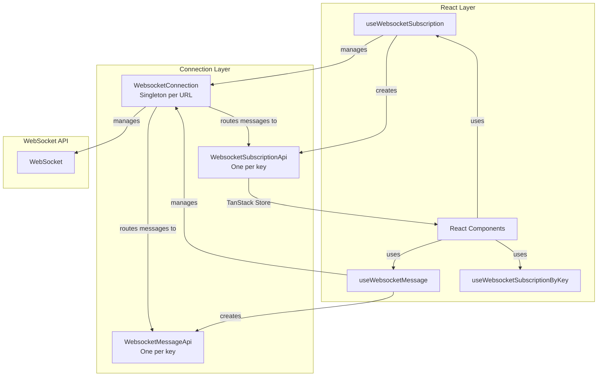
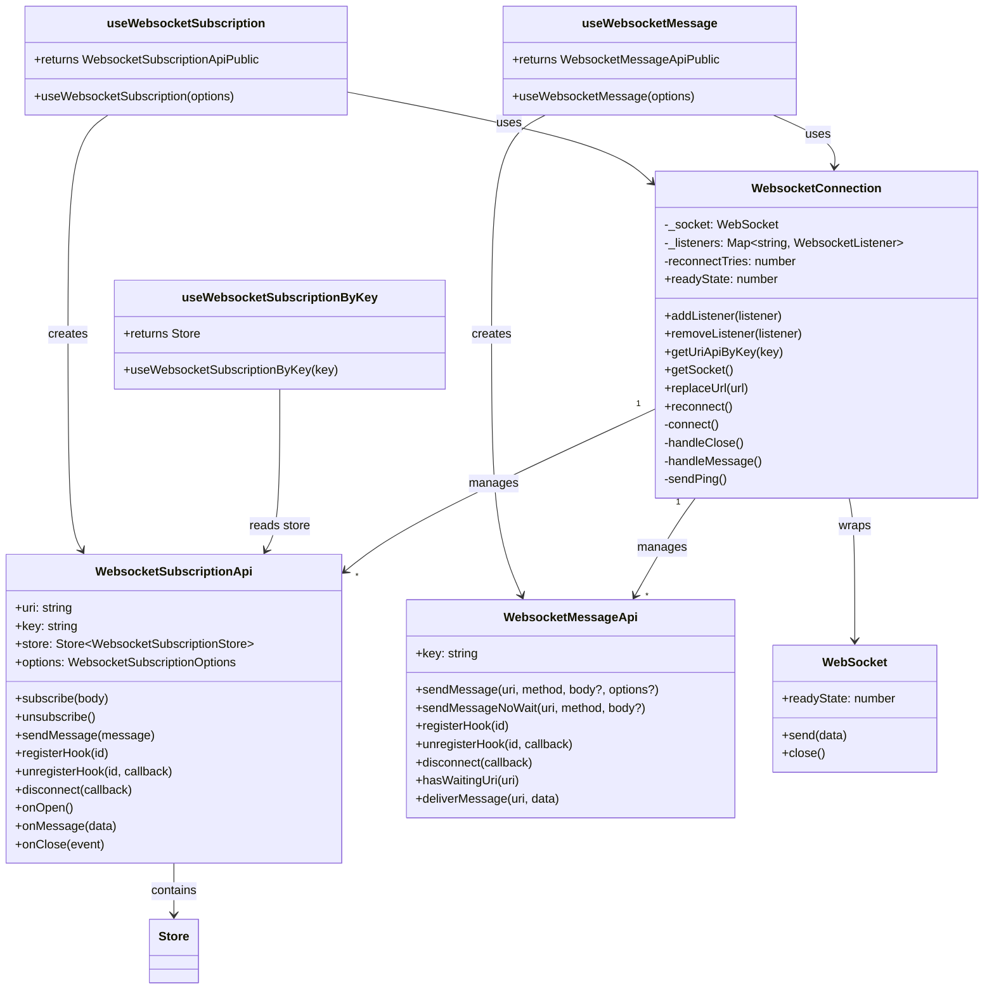
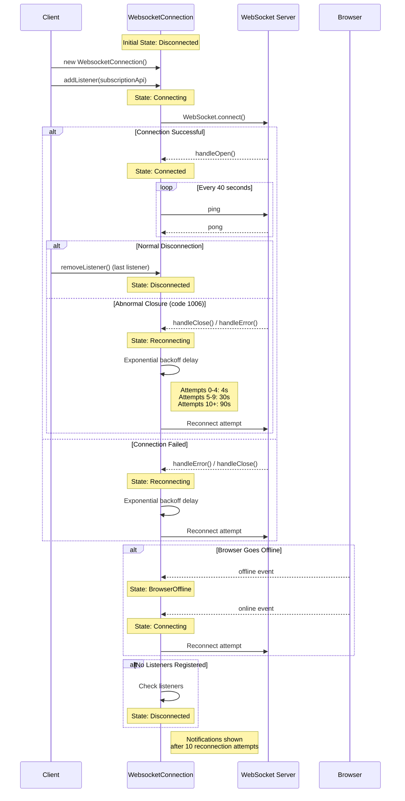
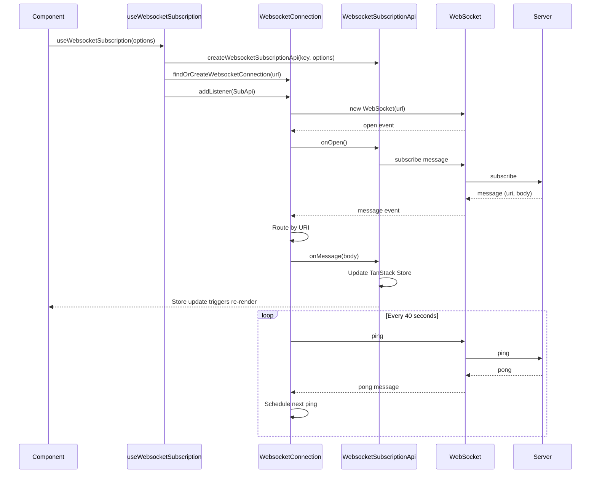
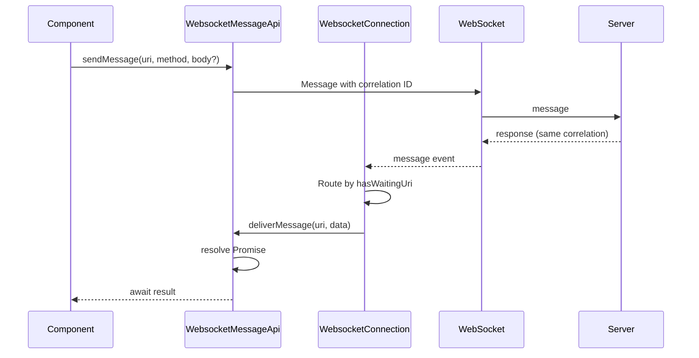
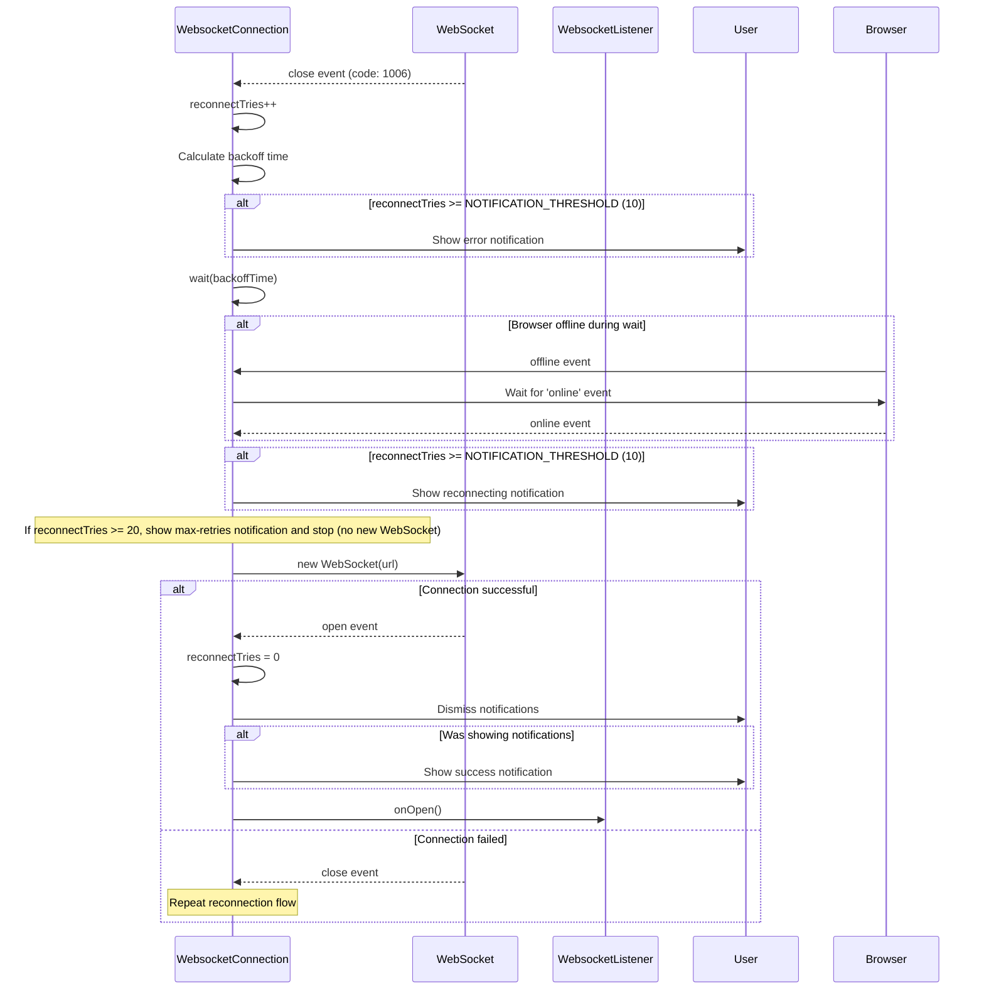
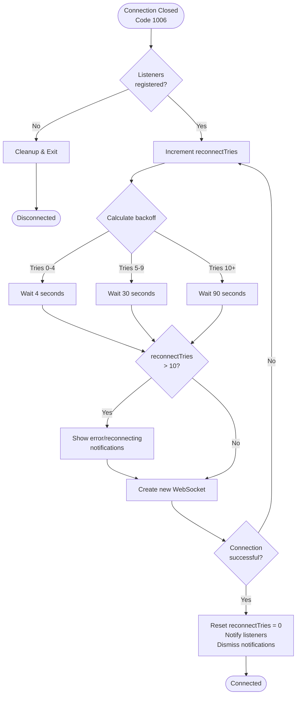
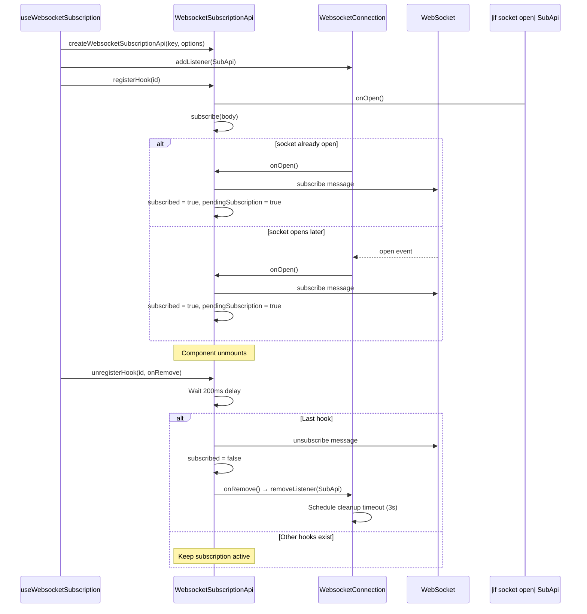
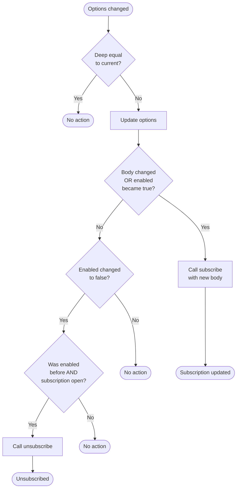

# WebSocket Connection Manager

A robust WebSocket connection manager with automatic reconnection, heartbeat monitoring, URI-based message routing, and React integration via TanStack Store.

## 📚 Navigation

### Internal Sections

- [Features](#features)
- [Architecture Overview](#architecture-overview)
- [Connection Lifecycle](#connection-lifecycle)
- [Message Flow](#message-flow)
- [URI API Lifecycle](#uri-api-lifecycle)
- [Usage Examples](#usage-examples)
- [App-Level Setup](#app-level-setup)
- [Configuration](#configuration)
- [API Reference](#api-reference)
- [Dependencies](#dependencies)

---

## Features

- **Singleton Connection Pattern**: One connection per URL shared across components
- **Key-Based API Management**: Subscription and Message APIs identified by unique keys; components with the same key share the instance
- **Automatic Reconnection**: Three-phase exponential backoff strategy
- **Heartbeat Monitoring**: Ping/pong mechanism (40s interval) to detect stale connections
- **URI-Based Routing**: Multiple subscriptions over a single connection
- **React Integration**: TanStack Store for reactive data updates
- **Online/Offline Detection**: Browser connectivity change handling
- **Two API Types**: **Subscription** (streaming) and **Message** (request/response)
- **User Notifications**: Status updates via snackbar notifications

## Architecture Overview

The system consists of three layers with two listener types:



### Component Relationships



## Connection Lifecycle

### State Diagram



## Message Flow

### Subscription Flow: React Component to Server



### Message API Flow: Request/Response



### Reconnection Flow



## Reconnection Strategy

### Backoff Calculation



## URI API Lifecycle

### Subscription Management



### Options Update Flow



## Browser Online/Offline Handling

```mermaid
sequenceDiagram
    participant Browser
    participant Connection as WebsocketConnection
    participant Socket as WebSocket
    participant Listener as WebsocketListener

    rect rgb(247, 45, 45)
    Note over Browser: Browser goes offline
    Browser->>Connection: offline event
    Connection->>Listener: onClose(CloseEvent)
    Connection->>Connection: removeListeners()
    Connection->>Socket: close()
    Connection->>Connection: _socket = undefined
    Connection->>Browser: addEventListener('online', handleOnline)
    end

    rect rgb(1, 79, 1)
    Note over Browser: Browser comes online
    Browser->>Connection: online event
    Connection->>Browser: removeEventListener('online')
    Connection->>Socket: new WebSocket(url)
    Socket-->>Connection: open event
    Connection->>Listener: onOpen()
    Connection->>Browser: addEventListener('offline')
    end
```



## Usage Examples

### Basic Subscription (Streaming Data)

```typescript
import { useWebsocketSubscription } from '@mono-fleet/use-websocket';
import { useStore } from '@tanstack/react-store';

function VoyageList() {
  const voyageApi = useWebsocketSubscription<Voyage[], VoyageFilters>({
    key: 'voyages-list',
    url: '/api',
    uri: '/api/voyages',
    body: { status: 'active' },
    onMessage: ({ data }) => console.log('Received:', data),
    onSubscribe: ({ uri }) => console.log('Subscribed to:', uri)
  });

  const voyages = useStore(voyageApi.store, (s) => s.message);
  const pending = useStore(voyageApi.store, (s) => s.pendingSubscription);

  if (pending) return <Skeleton />;
  return <div>{/* Render voyages */}</div>;
}
```

### Accessing Store from Child Components

```typescript
import { useWebsocketSubscription, useWebsocketSubscriptionByKey } from '@mono-fleet/use-websocket';
import { useStore } from '@tanstack/react-store';

// Parent: Creates the subscription
function VoyageListContainer() {
  useWebsocketSubscription<Voyage[]>({
    key: 'voyages-list',
    url: '/api',
    uri: '/api/voyages'
  });
  return <VoyageList />;
}

// Child: Accesses the store by key (no selector hook; use useStore with selector)
function VoyageList() {
  const voyagesStore = useWebsocketSubscriptionByKey<Voyage[]>('voyages-list');
  const voyages = useStore(voyagesStore, (s) => s.message);
  const activeVoyages = useStore(voyagesStore, (s) =>
    (s.message ?? []).filter((v) => v.status === 'active')
  );
  return <div>{/* Render active voyages */}</div>;
}

// Child: Voyage count
function VoyageCount() {
  const voyagesStore = useWebsocketSubscriptionByKey<Voyage[]>('voyages-list');
  const count = useStore(voyagesStore, (s) => (s.message ?? []).length);
  return <div>Total: {count}</div>;
}
```

### Message API (Request/Response)

```typescript
import { useWebsocketMessage } from '@mono-fleet/use-websocket';

function VoyageActions() {
  const api = useWebsocketMessage<ModifyVoyageUim, ModifyVoyageUim>({
    key: 'voyages/modify',
    url: '/api',
    responseTimeoutMs: 5000
  });

  const handleValidate = async () => {
    const result = await api.sendMessage('voyages/modify/validate', 'post', formValues);
    // ...
  };

  const handleMarkRead = () => {
    api.sendMessageNoWait(`notifications/${id}/read`, 'post');
  };

  return (
    <>
      <button onClick={handleValidate}>Validate</button>
      <button onClick={handleMarkRead}>Mark Read</button>
    </>
  );
}
```

### Store Shape (WebsocketSubscriptionStore)

```typescript
interface WebsocketSubscriptionStore<TData> {
  message: TData | undefined;       // Latest data from server
  subscribed: boolean;              // Subscription confirmed
  pendingSubscription: boolean;      // Subscribe sent, waiting for first response
  subscribedAt: number | undefined;
  receivedAt: number | undefined;
  connected: boolean;               // WebSocket open
  messageError: WebsocketTransportError | undefined;
  serverError: WebsocketServerError<unknown> | undefined;
}
```

## Configuration

### Timing Constants

| Setting                  | Value                   | Description                                            |
| ------------------------ | ----------------------- | ------------------------------------------------------ |
| Ping Interval            | 40 seconds              | Heartbeat ping frequency                               |
| Pong Timeout             | 10 seconds              | Time to wait for pong before considering connection dead |
| Connection Cleanup Delay | 3s (prod) / 10ms (test) | Delay before closing empty connection                  |
| Hook Removal Delay       | 200ms                   | Delay before unsubscribing when last hook removed      |
| Default Enabled          | true                    | Default enabled state for URI APIs                     |
| Message Response Timeout | 10 seconds              | Default timeout for `sendMessage` (Message API)        |
| Max Retry Attempts       | 20                      | Stop auto-reconnect after this many attempts           |

### Subscription Behavior

Subscriptions automatically subscribe when the WebSocket connection opens.

### Reconnection Backoff

| Attempt Range | Wait Time  | Description                          |
| ------------- | ---------- | ------------------------------------ |
| 0-4 attempts  | 4 seconds  | Fast retry for brief interruptions   |
| 5-9 attempts  | 30 seconds | Moderate delay for persistent issues |
| 10+ attempts  | 90 seconds | Slow retry for extended outages      |

### Notification Threshold

User notifications are only shown after **10 failed reconnection attempts** to prevent spam during brief network interruptions. Reconnection stops after **20 attempts** (~18 minutes); users can retry manually via the notification action.

## Events and Monitoring

WebSocket events can be logged by calling `WebsocketConnection.setCustomLogger` at app startup.

### Connection-Level Events
- `ws-connect`: Connection initiated
- `ws-close`: Connection closed (with code, reason, wasClean)
- `ws-error`: Error occurred
- `ws-reconnect`: Reconnection attempt (with tries count)

### Listener-Level Events
- `ws-on-open`: Listener notified when connection opens
- `ws-subscribe`: Subscription message sent
- `ws-unsubscribe`: Unsubscription message sent
- `ws-send-message`: Custom message sent (non-subscribe/unsubscribe)

## API Reference

### React Hooks

#### `useWebsocketSubscription<TData, TBody>(options): WebsocketSubscriptionApiPublic`

Manages a WebSocket subscription with reactive TanStack Store integration. Creates or reuses a `WebsocketSubscriptionApi` singleton per key. The WebSocket URL comes from `options.url` (apps typically build the full URL from auth context).

#### `useWebsocketSubscriptionByKey<TData>(key): Store<WebsocketSubscriptionStore<TData>>`

Returns the store of a subscription by key. Use when a parent creates the subscription and children need to read data. Returns a fallback store (initial empty state) if the subscription does not exist yet.

#### `useWebsocketMessage<TData, TBody>(options): WebsocketMessageApiPublic`

Manages a WebSocket Message API for request/response messaging. Use for one-off commands (validate, modify, mark read). Provides `sendMessage(uri, method, body?, options?)` and `sendMessageNoWait(uri, method, body?)`.

### WebsocketConnection Class

#### Public Methods

- `addListener(listener: WebsocketListener): WebsocketListener`
  - Registers a subscription or message API; initiates connection if needed
- `removeListener(listener: WebsocketListener): void`
  - Unregisters a listener and schedules cleanup if none remain
- `getUriApiByKey<TData>(key: string): WebsocketSubscriptionApi<TData, any> | undefined`
  - Retrieves a subscription API by key (message APIs are not returned)
- `getSocket(): WebSocket | undefined`
  - Returns the underlying WebSocket instance
- `replaceUrl(newUrl: string): Promise<void>`
  - Replaces the URL and re-establishes the connection
- `reconnect(): void`
  - Triggers reconnection. Called by `websocketConnectionsReconnect()` when `useReconnectWebsocketConnections` (from `@mono-fleet/common-components`) detects region/role change
- `handleClose(event: CloseEvent): Promise<void>`
  - Handles close events (public for testing)

#### Public Properties

- `readyState: number | undefined` — WebSocket ready state (0=CONNECTING, 1=OPEN, 2=CLOSING, 3=CLOSED)
- `url: string` — Current WebSocket URL

### WebsocketSubscriptionApi Class

#### Public Methods

- `subscribe(body?: TBody): void` — Subscribes to this URI endpoint
- `unsubscribe(): void` — Unsubscribes (when currently subscribed)
- `sendMessage(message: SendMessage): void` — Sends a custom message
- `registerHook(id: string): void` — Registers a hook using this API
- `unregisterHook(id: string, onRemove: () => void): void` — Unregisters; calls `onRemove` when last hook (after delay)
- `disconnect(onRemoveFromSocket: () => void): void` — Disconnects and invokes callback after delay
- `reset(): void` — Resets state (called on URL change/reconnection)

#### Public Properties

- `key: string` — Unique identifier
- `uri: string` — URI path for this subscription
- `store: Store<WebsocketSubscriptionStore<TData>>` — TanStack Store with `message`, `subscribed`, `pendingSubscription`, `connected`, etc.
- `options` — Configuration (setter triggers subscription updates)
- `isEnabled: boolean` — Whether this API is enabled

### WebsocketMessageApi Class

#### Public Methods

- `sendMessage(uri, method, body?, options?): Promise<TData>` — Sends and waits for response; `options.timeout` overrides default
- `sendMessageNoWait(uri, method, body?): void` — Fire-and-forget
- `reset(): void` — Cancels pending requests
- `registerHook(id: string): void` — Registers a hook
- `unregisterHook(id: string, onRemove: () => void): void` — Unregisters; calls `onRemove` when last hook
- `disconnect(onRemoveFromSocket: () => void): void` — Disconnects and invokes callback

#### Public Properties

- `key: string` — Unique identifier
- `url: string` — WebSocket URL
- `isEnabled: boolean` — Whether this API is enabled

### Internal Helpers (websocketStores.helpers)

These functions are used internally by the hooks and are not exported from the package:

- `findOrCreateWebsocketConnection(key, url)` — Gets or creates connection singleton (key = URL path)
- `getExistingWebsocketConnection(key)` — Gets existing connection
- `createWebsocketSubscriptionApi(key, options)` — Creates or returns WebsocketSubscriptionApi singleton
- `createWebsocketMessageApi(key, options)` — Creates or returns WebsocketMessageApi singleton
- `getWebsocketUriApiByKey(key)` — Retrieves subscription API by key
- `getWebsocketMessageApiByKey(key)` — Retrieves message API by key
- `removeWebsocketListenerFromConnection(listener)` — Removes listener from connection and store

## Dependencies

- `@tanstack/react-store`: Reactive state management
- `@tanstack/store`: Core store implementation
- `@mono-fleet/common-utils`: Utility functions (wait)
- `notistack`: User notifications
- `uuid`: Correlation ID generation
- `fast-equals`: Deep equality comparison
- `usehooks-ts`: React hooks utilities (useIsomorphicLayoutEffect)
