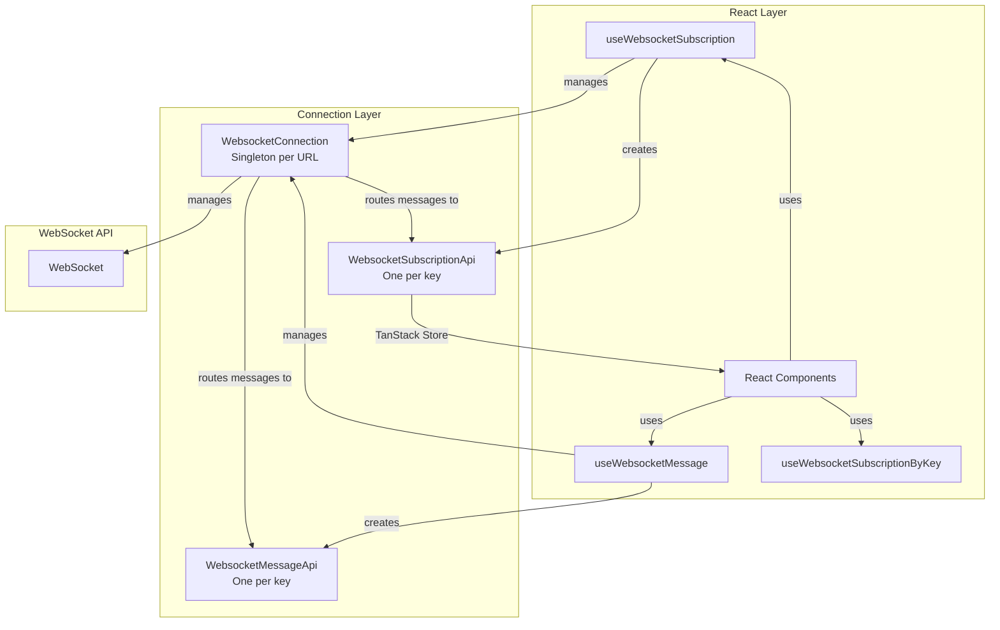
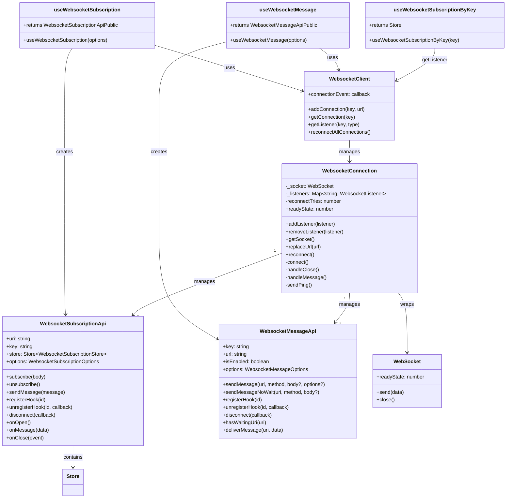
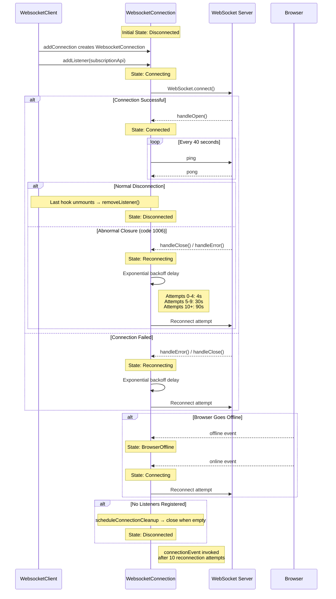
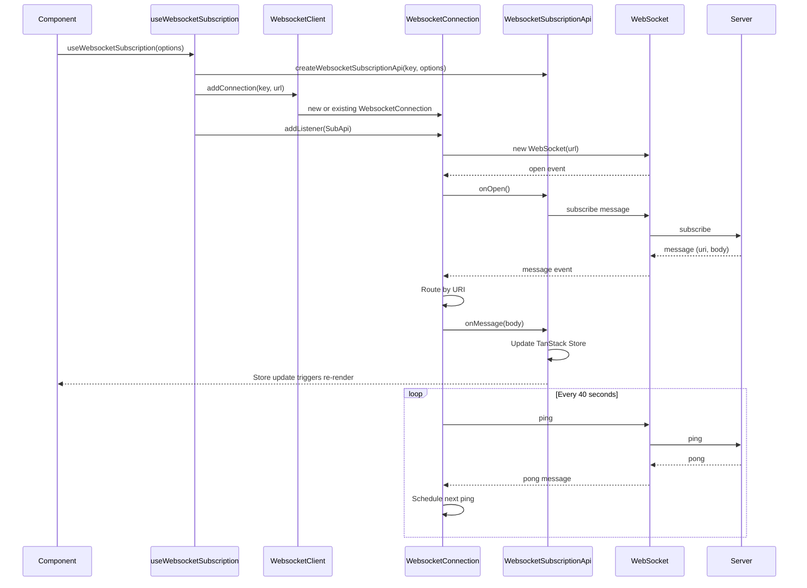
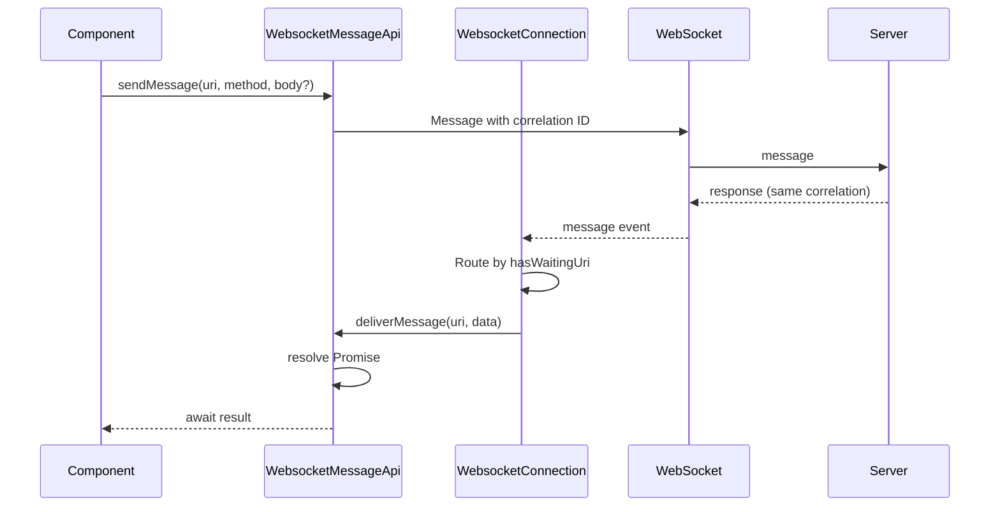
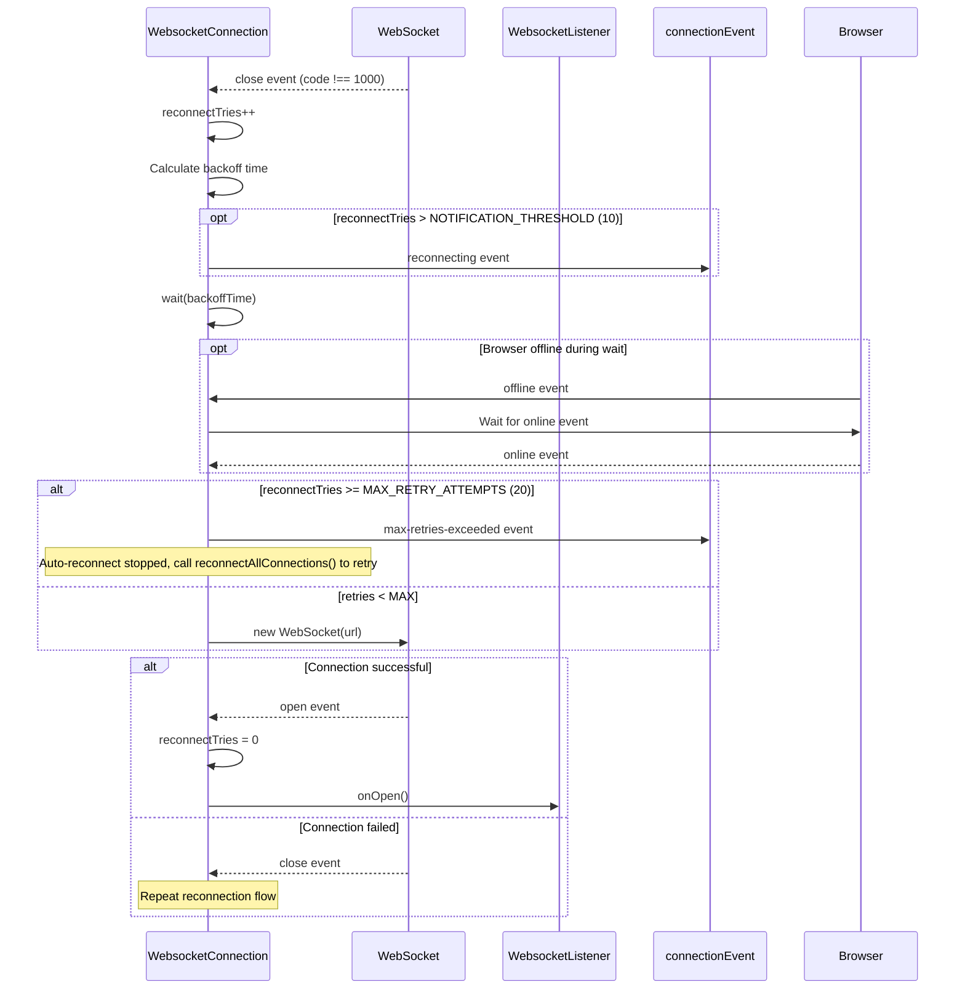
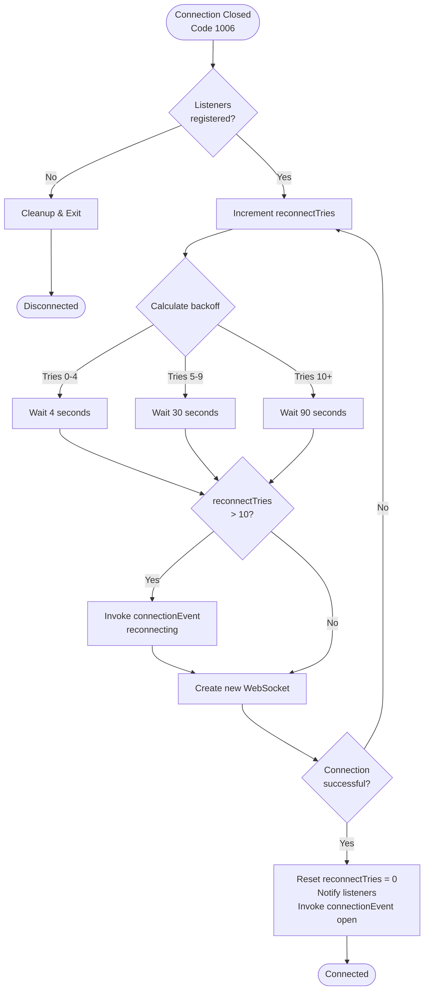
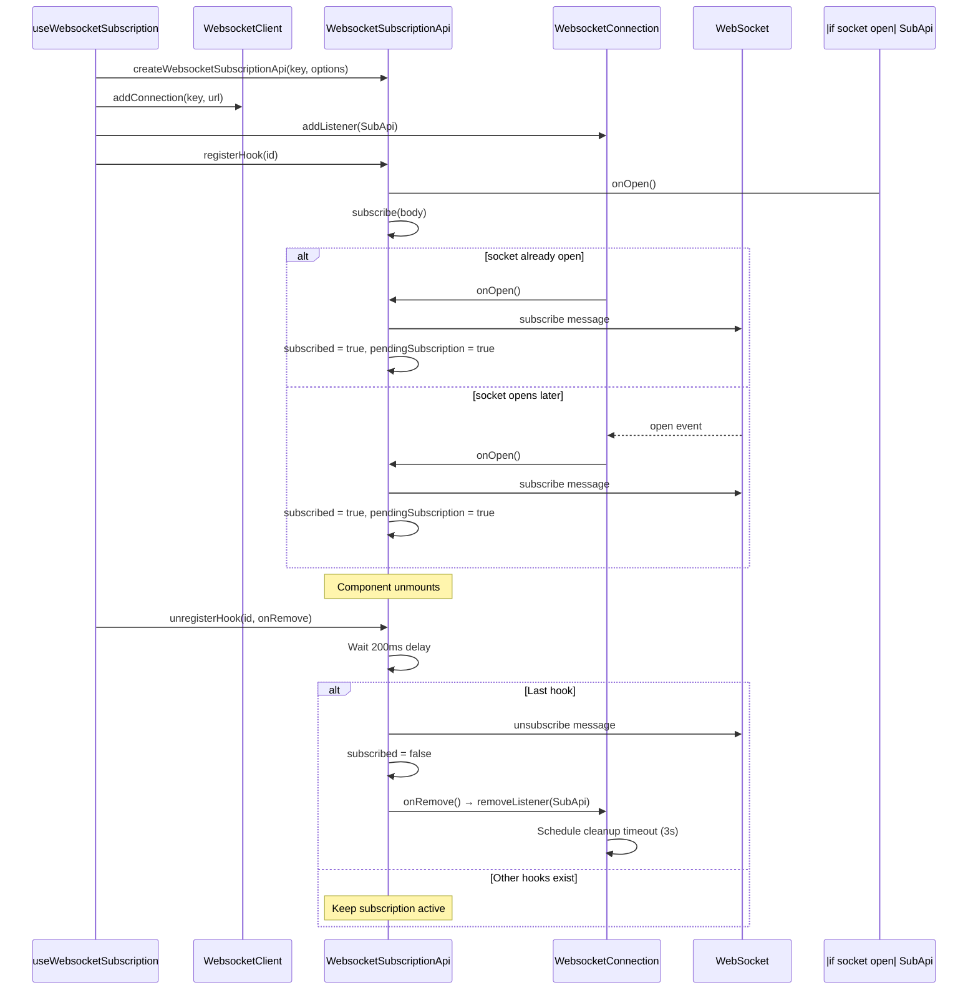
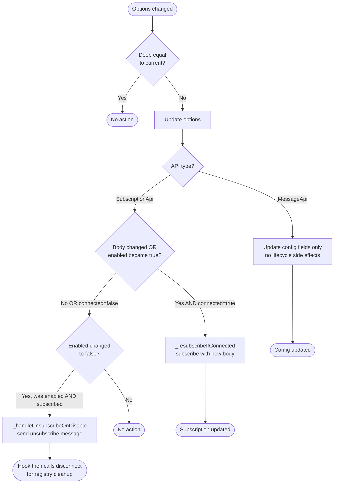
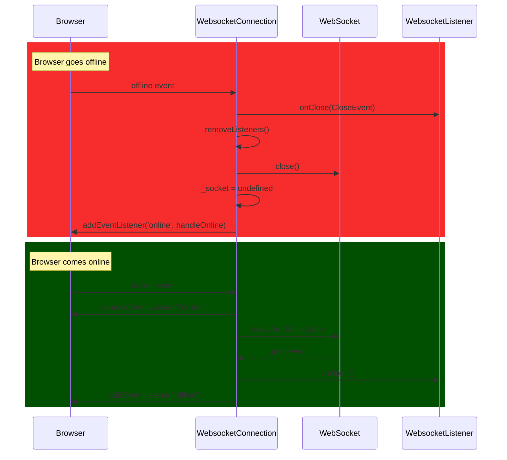

# WebSocket Connection Manager

A robust WebSocket connection manager with automatic reconnection, heartbeat monitoring, URI-based message routing, and React integration via TanStack Store.

## 📚 Navigation

### External Links

- **[Package README](../../README.md)** — Package overview and quick start
- **[CHART](./CHART.md)** — Return to workspace overview

### Internal Sections

- [Architecture Overview](#architecture-overview)
- [Connection Lifecycle](#connection-lifecycle)
- [Message Flow](#message-flow)
- [URI API Lifecycle](#uri-api-lifecycle)
- [Configuration](#configuration)
- [Events and Monitoring](#events-and-monitoring)
- [API Reference](#api-reference)

---

## Architecture Overview

The system consists of three layers with two listener types:

```mermaid
graph TB
    subgraph "React Layer"
        SubHook[useWebsocketSubscription]
        MsgHook[useWebsocketMessage]
        ByKeyHook[useWebsocketSubscriptionByKey]
        Component[React Components]
    end

    subgraph "Connection Layer"
        Connection[WebsocketConnection<br/>Singleton per URL]
        SubApi[WebsocketSubscriptionApi<br/>One per key]
        MsgApi[WebsocketMessageApi<br/>One per key]
    end

    subgraph "WebSocket API"
        Socket[WebSocket]
    end

    Component -->|uses| SubHook
    Component -->|uses| MsgHook
    Component -->|uses| ByKeyHook
    SubHook -->|manages| Connection
    MsgHook -->|manages| Connection
    SubHook -->|creates| SubApi
    MsgHook -->|creates| MsgApi
    Connection -->|manages| Socket
    Connection -->|routes messages to| SubApi
    Connection -->|routes messages to| MsgApi
    SubApi -->|TanStack Store| Component
```

### Component Relationships

```mermaid
classDiagram
    class useWebsocketSubscription {
        +useWebsocketSubscription(options)
        +returns WebsocketSubscriptionApiPublic
    }

    class useWebsocketMessage {
        +useWebsocketMessage(options)
        +returns WebsocketMessageApiPublic
    }

    class useWebsocketSubscriptionByKey {
        +useWebsocketSubscriptionByKey(key)
        +returns Store
    }

    class WebsocketClient {
        +addConnection(key, url)
        +getConnection(key)
        +getListener(key, type)
        +reconnectAllConnections()
        +connectionEvent: callback
    }

    class WebsocketConnection {
        -_socket: WebSocket
        -_listeners: Map~string, WebsocketListener~
        -reconnectTries: number
        +addListener(listener)
        +removeListener(listener)
        +getSocket()
        +replaceUrl(url)
        +reconnect()
        +readyState: number
        -connect()
        -handleClose()
        -handleMessage()
        -sendPing()
    }

    class WebsocketSubscriptionApi {
        +uri: string
        +key: string
        +store: Store~WebsocketSubscriptionStore~
        +options: WebsocketSubscriptionOptions
        +subscribe(body)
        +unsubscribe()
        +sendMessage(message)
        +registerHook(id)
        +unregisterHook(id, callback)
        +disconnect(callback)
        +onOpen()
        +onMessage(data)
        +onClose(event)
    }

    class WebsocketMessageApi {
        +key: string
        +url: string
        +isEnabled: boolean
        +options: WebsocketMessageOptions
        +sendMessage(uri, method, body?, options?)
        +sendMessageNoWait(uri, method, body?)
        +registerHook(id)
        +unregisterHook(id, callback)
        +disconnect(callback)
        +hasWaitingUri(uri)
        +deliverMessage(uri, data)
    }

    class WebSocket {
        +readyState: number
        +send(data)
        +close()
    }

    useWebsocketSubscription --> WebsocketClient : uses
    useWebsocketMessage --> WebsocketClient : uses
    useWebsocketSubscriptionByKey --> WebsocketClient : getListener
    useWebsocketSubscription --> WebsocketSubscriptionApi : creates
    useWebsocketMessage --> WebsocketMessageApi : creates
    WebsocketClient --> WebsocketConnection : manages
    WebsocketConnection "1" --> "*" WebsocketSubscriptionApi : manages
    WebsocketConnection "1" --> "*" WebsocketMessageApi : manages
    WebsocketConnection --> WebSocket : wraps
    WebsocketSubscriptionApi --> Store : contains
```

## Connection Lifecycle

### State Diagram

```mermaid
sequenceDiagram
    participant Client as WebsocketClient
    participant Connection as WebsocketConnection
    participant Server as WebSocket Server
    participant Browser

    Note over Connection: Initial State: Disconnected

    Client->>Connection: addConnection creates WebsocketConnection
    Client->>Connection: addListener(subscriptionApi)

    Note over Connection: State: Connecting
    Connection->>Server: WebSocket.connect()

    alt Connection Successful
        Server-->>Connection: handleOpen()
        Note over Connection: State: Connected

        loop Every 40 seconds
            Connection->>Server: ping
            Server-->>Connection: pong
        end

        alt Normal Disconnection
            Note over Client,Connection: Last hook unmounts → removeListener()
            Note over Connection: State: Disconnected
        else Abnormal Closure (code 1006)
            Server-->>Connection: handleClose() / handleError()
            Note over Connection: State: Reconnecting
            Connection->>Connection: Exponential backoff delay
            Note right of Connection: Attempts 0-4: 4s<br/>Attempts 5-9: 30s<br/>Attempts 10+: 90s
            Connection->>Server: Reconnect attempt
        end
    else Connection Failed
        Server-->>Connection: handleError() / handleClose()
        Note over Connection: State: Reconnecting
        Connection->>Connection: Exponential backoff delay
        Connection->>Server: Reconnect attempt
    end

    alt Browser Goes Offline
        Browser-->>Connection: offline event
        Note over Connection: State: BrowserOffline
        Browser-->>Connection: online event
        Note over Connection: State: Connecting
        Connection->>Server: Reconnect attempt
    end

    alt No Listeners Registered
        Note over Connection: scheduleConnectionCleanup → close when empty
        Note over Connection: State: Disconnected
    end

    Note right of Connection: connectionEvent invoked<br/>after 10 reconnection attempts
```

## Message Flow

### Subscription Flow: React Component to Server

```mermaid
sequenceDiagram
    participant Component
    participant Hook as useWebsocketSubscription
    participant Client as WebsocketClient
    participant Connection as WebsocketConnection
    participant SubApi as WebsocketSubscriptionApi
    participant Socket as WebSocket
    participant Server

    Component->>Hook: useWebsocketSubscription(options)
    Hook->>SubApi: createWebsocketSubscriptionApi(key, options)
    Hook->>Client: addConnection(key, url)
    Client->>Connection: new or existing WebsocketConnection
    Hook->>Connection: addListener(SubApi)
    Connection->>Socket: new WebSocket(url)

    Socket-->>Connection: open event
    Connection->>SubApi: onOpen()
    SubApi->>Socket: subscribe message
    Socket->>Server: subscribe

    Server-->>Socket: message (uri, body)
    Socket-->>Connection: message event
    Connection->>Connection: Route by URI
    Connection->>SubApi: onMessage(body)
    SubApi->>SubApi: Update TanStack Store
    SubApi-->>Component: Store update triggers re-render

    loop Every 40 seconds
        Connection->>Socket: ping
        Socket->>Server: ping
        Server-->>Socket: pong
        Socket-->>Connection: pong message
        Connection->>Connection: Schedule next ping
    end
```

### Message API Flow: Request/Response

```mermaid
sequenceDiagram
    participant Component
    participant MsgApi as WebsocketMessageApi
    participant Connection as WebsocketConnection
    participant Socket as WebSocket
    participant Server

    Component->>MsgApi: sendMessage(uri, method, body?)
    MsgApi->>Socket: Message with correlation ID
    Socket->>Server: message

    Server-->>Socket: response (same correlation)
    Socket-->>Connection: message event
    Connection->>Connection: Route by hasWaitingUri
    Connection->>MsgApi: deliverMessage(uri, data)
    MsgApi->>MsgApi: resolve Promise
    MsgApi-->>Component: await result
```

### Reconnection Flow

```mermaid
sequenceDiagram
    participant Connection as WebsocketConnection
    participant Socket as WebSocket
    participant Listener as WebsocketListener
    participant Callback as connectionEvent
    participant Browser

    Socket-->>Connection: close event (code !== 1000)
    Connection->>Connection: reconnectTries++
    Connection->>Connection: Calculate backoff time

    opt reconnectTries > NOTIFICATION_THRESHOLD (10)
        Connection->>Callback: reconnecting event
    end

    Connection->>Connection: wait(backoffTime)

    opt Browser offline during wait
        Browser->>Connection: offline event
        Connection->>Browser: Wait for online event
        Browser-->>Connection: online event
    end

    alt reconnectTries >= MAX_RETRY_ATTEMPTS (20)
        Connection->>Callback: max-retries-exceeded event
        Note over Connection: Auto-reconnect stopped, call reconnectAllConnections() to retry
    else retries < MAX
        Connection->>Socket: new WebSocket(url)
    end

    alt Connection successful
        Socket-->>Connection: open event
        Connection->>Connection: reconnectTries = 0
        Connection->>Listener: onOpen()
    else Connection failed
        Socket-->>Connection: close event
        Note over Connection: Repeat reconnection flow
    end
```

## Reconnection Strategy

### Backoff Calculation

```mermaid
flowchart TD
    Start([Connection Closed<br/>Code 1006]) --> CheckListeners{Listeners<br/>registered?}

    CheckListeners -->|No| Cleanup[Cleanup & Exit]
    CheckListeners -->|Yes| Increment[Increment reconnectTries]

    Increment --> CalcBackoff{Calculate backoff}

    CalcBackoff -->|Tries 0-4| Wait4[Wait 4 seconds]
    CalcBackoff -->|Tries 5-9| Wait30[Wait 30 seconds]
    CalcBackoff -->|Tries 10+| Wait90[Wait 90 seconds]

    Wait4 --> CheckNotify{reconnectTries<br/>> 10?}
    Wait30 --> CheckNotify
    Wait90 --> CheckNotify

    CheckNotify -->|Yes| InvokeCallback[Invoke connectionEvent<br/>reconnecting]
    CheckNotify -->|No| Reconnect
    InvokeCallback --> Reconnect[Create new WebSocket]

    Reconnect --> Success{Connection<br/>successful?}
    Success -->|Yes| Reset[Reset reconnectTries = 0<br/>Notify listeners<br/>Invoke connectionEvent open]
    Success -->|No| Increment

    Reset --> End([Connected])
    Cleanup --> End2([Disconnected])
```

## URI API Lifecycle

### Subscription Management

```mermaid
sequenceDiagram
    participant Hook as useWebsocketSubscription
    participant Client as WebsocketClient
    participant SubApi as WebsocketSubscriptionApi
    participant Connection as WebsocketConnection
    participant Socket as WebSocket

    Hook->>SubApi: createWebsocketSubscriptionApi(key, options)
    Hook->>Client: addConnection(key, url)
    Hook->>Connection: addListener(SubApi)
    Hook->>SubApi: registerHook(id)
    SubApi->|if socket open| SubApi: onOpen()
    SubApi->>SubApi: subscribe(body)

    alt socket already open
        Connection->>SubApi: onOpen()
        SubApi->>Socket: subscribe message
        SubApi->>SubApi: subscribed = true, pendingSubscription = true
    else socket opens later
        Socket-->>Connection: open event
        Connection->>SubApi: onOpen()
        SubApi->>Socket: subscribe message
        SubApi->>SubApi: subscribed = true, pendingSubscription = true
    end

    Note over SubApi: Component unmounts

    Hook->>SubApi: unregisterHook(id, onRemove)
    SubApi->>SubApi: Wait 200ms delay

    alt Last hook
        SubApi->>Socket: unsubscribe message
        SubApi->>SubApi: subscribed = false
        SubApi->>Connection: onRemove() → removeListener(SubApi)
        Connection->>Connection: Schedule cleanup timeout (3s)
    else Other hooks exist
        Note over SubApi: Keep subscription active
    end
```

### Options Update Flow

Applies to both `WebsocketSubscriptionApi` (via `useWebsocketSubscription`) and `WebsocketMessageApi` (via `useWebsocketMessage`). Both hooks sync options with a `useIsomorphicLayoutEffect` after every render where options deep-changed.

```mermaid
flowchart TD
    Start([Options changed]) --> CheckEqual{Deep equal<br/>to current?}

    CheckEqual -->|Yes| End1([No action])
    CheckEqual -->|No| UpdateOptions[Update options]

    UpdateOptions --> ApiType{API type?}

    ApiType -->|SubscriptionApi| CheckConnected{Body changed OR<br/>enabled became true?}
    ApiType -->|MessageApi| UpdateFields[Update config fields only<br/>no lifecycle side effects]

    CheckConnected -->|Yes AND connected=true| Resubscribe[_resubscribeIfConnected<br/>subscribe with new body]
    CheckConnected -->|No OR connected=false| CheckDisable{Enabled changed<br/>to false?}

    CheckDisable -->|Yes, was enabled AND subscribed| Unsubscribe[_handleUnsubscribeOnDisable<br/>send unsubscribe message]
    CheckDisable -->|No| End3([No action])

    Resubscribe --> End6([Subscription updated])
    Unsubscribe --> End7([Hook then calls disconnect<br/>for registry cleanup])
    UpdateFields --> End8([Config updated])
```

> **Note:** `_resubscribeIfConnected` only fires when `connected=true`. When not connected, `addListener→onOpen` handles subscription once the socket opens — preventing a double-subscribe.

## Browser Online/Offline Handling

```mermaid
sequenceDiagram
    participant Browser
    participant Connection as WebsocketConnection
    participant Socket as WebSocket
    participant Listener as WebsocketListener

    rect rgb(247, 45, 45)
    Note over Browser: Browser goes offline
    Browser->>Connection: offline event
    Connection->>Listener: onClose(CloseEvent)
    Connection->>Connection: removeListeners()
    Connection->>Socket: close()
    Connection->>Connection: _socket = undefined
    Connection->>Browser: addEventListener('online', handleOnline)
    end

    rect rgb(1, 79, 1)
    Note over Browser: Browser comes online
    Browser->>Connection: online event
    Connection->>Browser: removeEventListener('online')
    Connection->>Socket: new WebSocket(url)
    Socket-->>Connection: open event
    Connection->>Listener: onOpen()
    Connection->>Browser: addEventListener('offline')
    end
```

## Configuration

### Timing Constants

| Setting                  | Value                   | Description                                            |
| ------------------------ | ----------------------- | ------------------------------------------------------ |
| Ping Interval            | 40 seconds              | Heartbeat ping frequency                               |
| Pong Timeout             | 10 seconds              | Time to wait for pong before considering connection dead |
| Connection Cleanup Delay | 3s (prod) / 10ms (test) | Delay before closing empty connection                  |
| Hook Removal Delay       | 200ms                   | Delay before unsubscribing when last hook removed      |
| Default Enabled          | true                    | Default enabled state for URI APIs                     |
| Message Response Timeout | 10 seconds              | Default timeout for `sendMessage` (Message API)        |
| Max Retry Attempts       | 20                      | Stop auto-reconnect after this many attempts           |

### Subscription Behavior

Subscriptions automatically subscribe when the WebSocket connection opens.

### Reconnection Backoff

| Attempt Range | Wait Time  | Description                          |
| ------------- | ---------- | ------------------------------------ |
| 0-4 attempts  | 4 seconds  | Fast retry for brief interruptions   |
| 5-9 attempts  | 30 seconds | Moderate delay for persistent issues |
| 10+ attempts  | 90 seconds | Slow retry for extended outages      |

### Notification Threshold

The `connectionEvent` callback is invoked with `reconnecting` only after **10 failed reconnection attempts** to avoid spam during brief network interruptions. Reconnection stops after **20 attempts** (~18 minutes); call `WebsocketClient.reconnectAllConnections()` to retry manually.

## Events and Monitoring

Configure `connectionEvent` on `WebsocketClient` to receive connection lifecycle events. Event types:

### Connection-Level Events
- `connect`: Connection initiated
- `open`: Connection opened
- `close`: Connection closed (with code, reason, wasClean, subscriptions count)
- `error`: Transport error occurred
- `reconnecting`: Reconnection attempt (with retries count)
- `max-retries-exceeded`: Auto-reconnect stopped; call `reconnectAllConnections()` to retry
- `pong-timeout`: No pong received within heartbeat timeout
- `cleanup`: Connection cleaned up (no listeners remain)

### Message Events
- `send-message`: Outgoing message sent
- `invalid-message`: Incoming message missing required structure
- `parse-error`: Failed to parse incoming JSON
- `message-error`: Server sent error (method: error, conflict, or exception)

## API Reference

### React Hooks

#### `useWebsocketSubscription<TData, TBody>(options): WebsocketSubscriptionApiPublic`

Manages a WebSocket subscription with reactive TanStack Store integration. Creates or reuses a `WebsocketSubscriptionApi` singleton per key. The WebSocket URL comes from `options.url` (apps typically build the full URL from auth context).

#### `useWebsocketSubscriptionByKey<TData>(key): Store<WebsocketSubscriptionStore<TData>>`

Returns the store of a subscription by key. Use when a parent creates the subscription and children need to read data. Returns a fallback store (initial empty state) if the subscription does not exist yet.

#### `useSelector<TStore, TResult>(store, selector): TResult`

Selects a value from a WebSocket subscription store with reactive updates. Use with the store from `useWebsocketSubscription` or `useWebsocketSubscriptionByKey`. The selector receives typed state; re-renders when the selected value changes (shallow comparison).

#### `useWebsocketMessage<TData, TBody>(options): WebsocketMessageApiPublic`

Manages a WebSocket Message API for request/response messaging. Use for one-off commands (validate, modify, mark read). Syncs `options` to the API after each render where options changed (mirrors `useWebsocketSubscription`). Provides `sendMessage(uri, method, body?, options?)` and `sendMessageNoWait(uri, method, body?)`.

### WebsocketClient Class

#### Public Methods

- `addConnection(key: string, url: string): WebsocketConnection`
  - Gets or creates a connection for the given key/URL
- `getConnection(key: string): WebsocketConnection | undefined`
  - Returns the connection for the given key
- `getListener<TData>(key: string, type: 'subscription' | 'message'): WebsocketSubscriptionApi | WebsocketMessageApi | undefined`
  - Returns a listener by key and type
- `reconnectAllConnections(): void`
  - Reconnects all active connections (e.g. when URL changes)

#### Configuration (constructor options)

- `connectionEvent?: (event) => void` — Callback for connection lifecycle events
- `maxRetryAttempts`, `notificationThreshold`, `heartbeat`, etc.

### WebsocketConnection Class

#### Public Methods

- `addListener(listener: WebsocketListener): WebsocketListener`
  - Registers a subscription or message API; initiates connection if needed
- `removeListener(listener: WebsocketListener): void`
  - Unregisters a listener and schedules cleanup if none remain
- `getSocket(): WebSocket | undefined`
  - Returns the underlying WebSocket instance
- `replaceUrl(newUrl: string): Promise<void>`
  - Replaces the URL and re-establishes the connection
- `reconnect(): Promise<void>`
  - Tears down and re-establishes the connection
- `resetRetriesAndReconnect(): void`
  - Resets retry counter and reconnects (e.g. after max-retries-exceeded)

#### Public Properties

- `readyState: number | undefined` — WebSocket ready state (0=CONNECTING, 1=OPEN, 2=CLOSING, 3=CLOSED)
- `url: string` — Current WebSocket URL

### WebsocketSubscriptionApi Class

#### Public Methods

- `subscribe(body?: TBody): void` — Subscribes to this URI endpoint
- `unsubscribe(): void` — Unsubscribes (when currently subscribed)
- `sendMessage(message: SendMessage): void` — Sends a custom message
- `registerHook(id: string): void` — Registers a hook using this API
- `unregisterHook(id: string, onRemove: () => void): void` — Unregisters; calls `onRemove` when last hook (after delay)
- `disconnect(onRemoveFromSocket: () => void): void` — Schedules state cleanup and registry removal after `INITIATOR_REMOVAL_DELAY_MS`; does **not** send an unsubscribe (the options setter's `_handleUnsubscribeOnDisable` handles that)
- `reset(): void` — Resets state (called on URL change/reconnection)

#### Public Properties

- `key: string` — Unique identifier
- `uri: string` — URI path for this subscription
- `store: Store<WebsocketSubscriptionStore<TData>>` — TanStack Store with `message`, `subscribed`, `pendingSubscription`, `connected`, etc.
- `options` — Configuration (setter triggers subscription updates)
- `isEnabled: boolean` — Whether this API is enabled

### WebsocketMessageApi Class

#### Public Methods

- `sendMessage(uri, method, body?, options?): Promise<TData>` — Sends and waits for response; `options.timeout` overrides default
- `sendMessageNoWait(uri, method, body?): void` — Fire-and-forget
- `reset(): void` — Cancels pending requests
- `registerHook(id: string): void` — Registers a hook
- `unregisterHook(id: string, onRemove: () => void): void` — Unregisters; calls `onRemove` when last hook
- `disconnect(onRemoveFromSocket: () => void): void` — Schedules state cleanup and registry removal; does **not** send an unsubscribe message (the options setter handles that)

#### Public Properties

- `key: string` — Unique identifier
- `url: string` — WebSocket URL
- `isEnabled: boolean` — Whether this API is enabled
- `options: WebsocketMessageOptions` (setter) — Updates config fields; deep-equal guarded; no lifecycle side effects

### Internal Helpers (websocketClient.helpers)

These functions are used internally by the hooks and are not exported from the package:

- `createWebsocketSubscriptionApi(client, key, options)` — Creates or returns WebsocketSubscriptionApi singleton
- `createWebsocketMessageApi(client, key, options)` — Creates or returns WebsocketMessageApi singleton
- `removeWebsocketListenerFromConnection(client, listener)` — Removes listener from connection and client

## License

MIT
